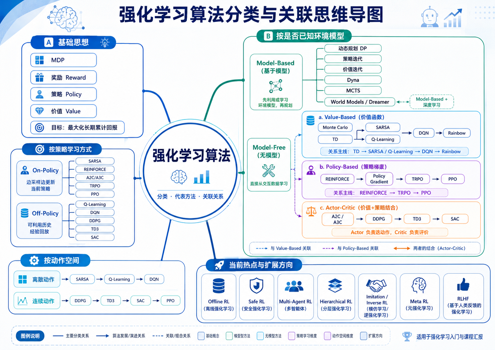

# 课程导入：为什么要学习强化学习？


> 强化学习研究的是：一个智能体如何通过与环境不断交互，在奖励反馈中学会做出更好的长期决策。

强化学习的英文是 **Reinforcement Learning**，简称 **RL**。它和监督学习、无监督学习最大的区别在于：强化学习不是直接学习标准答案，而是在不断试错中学习“怎么做决策”。

举几个直观例子：

- 打游戏：当前画面是状态，按键是动作，得分是奖励。
- 机器人走路：机器人的位置和姿态是状态，电机控制是动作，是否摔倒或前进距离是奖励。
- 自动驾驶：路况、车速、障碍物是状态，转向、刹车、加速是动作，安全到达目的地是奖励。
- 推荐系统：用户当前兴趣是状态，推荐内容是动作，点击、停留时长和满意度是奖励。
- 学习计划：当前学习水平是状态，选择复习哪门课是动作，成绩提升是奖励。

强化学习最重要的特点是：

> 没有人直接告诉智能体每一步应该怎么做，它需要通过和环境交互，根据奖励不断调整自己的行为。

## 强化学习与其他机器学习方法的区别

| 学习类型 | 数据形式 | 核心目标 | 典型例子 |
|---|---|---|---|
| 监督学习 | 输入和标签 | 学会预测 | 图像分类、房价预测 |
| 无监督学习 | 只有数据，没有标签 | 发现结构 | 聚类、降维 |
| 强化学习 | 状态、动作、奖励 | 学会决策 | 游戏 AI、机器人控制 |

监督学习更像“老师给标准答案”；强化学习更像“自己试错，做得好就奖励，做得差就惩罚”。

例如，训练一个识别猫狗的模型时，监督学习会告诉模型每张图片是猫还是狗；但训练一个玩游戏的智能体时，通常不会告诉它“这一帧必须按左键”，而是告诉它最后得了多少分。

所以强化学习的核心不是单纯预测，而是**序列决策**。

---

# 一、强化学习的基本框架

强化学习通常包含五个基本要素：智能体、环境、状态、动作和奖励。

## 1.1 Agent 与 Environment

**Agent** 是智能体，也就是做决策的主体。例如游戏 AI、机器人、自动驾驶汽车、推荐系统或大模型智能体。

**Environment** 是环境，也就是智能体所处的外部世界。智能体采取动作后，环境会发生变化，并返回新的状态和奖励。

强化学习的基本循环如下：

```{mermaid}
flowchart LR
    A[Agent 智能体] -->|Action 动作| B[Environment 环境]
    B -->|State 状态| A
    B -->|Reward 奖励| A
```

这个过程可以描述为：

1. 智能体观察当前状态 $S_t$；
2. 根据策略 $\pi$ 选择动作 $A_t$；
3. 环境接收动作后转移到新状态 $S_{t+1}$；
4. 环境给出奖励 $R_{t+1}$；
5. 智能体根据奖励调整自己的策略；
6. 重复以上过程。

## 1.2 State、Action、Reward 和 Policy

状态记作 $S_t$，表示时刻 $t$ 环境的信息。例如游戏画面、机器人位置、棋盘局面、用户当前兴趣等。

动作记作 $A_t$，表示智能体在当前状态下采取的行为。例如游戏中向左、向右、跳跃，自动驾驶中加速、刹车、转向。

奖励记作 $R_{t+1}$，表示智能体采取动作之后，环境给出的反馈。奖励可以是正的，也可以是负的。

策略记作 $\pi$，它描述智能体在某个状态下应该采取什么动作。

如果策略是确定性的，可以写成：

$$
a = \pi(s)
$$

表示在状态 $s$ 下直接选择动作 $a$。

如果策略是随机性的，可以写成：

$$
\pi(a|s)
$$

表示在状态 $s$ 下选择动作 $a$ 的概率。

强化学习的目标是找到一个好策略，使智能体获得尽可能大的长期累计奖励。

---

# 二、MDP、回报与价值函数

强化学习的数学基础通常是 **马尔可夫决策过程**，英文是 Markov Decision Process，简称 **MDP**。

## 2.1 马尔可夫决策过程 MDP

MDP 可以写成一个五元组：

$$
(S, A, P, R, \gamma)
$$

其中：

- $S$：状态集合；
- $A$：动作集合；
- $P$：状态转移概率；
- $R$：奖励函数；
- $\gamma$：折扣因子。

状态转移概率记作：

$$
P(s'|s,a)
$$

它表示当前处于状态 $s$，采取动作 $a$，下一步转移到状态 $s'$ 的概率。

奖励函数可以写成：

$$
R(s,a,s')
$$

表示从状态 $s$ 出发，采取动作 $a$，到达状态 $s'$ 后得到的奖励。

折扣因子记作：

$$
\gamma \in [0,1]
$$

它衡量未来奖励的重要程度：

- $\gamma = 0$：只关心眼前奖励；
- $\gamma$ 接近 $1$：非常重视长期奖励；
- 实际应用中常取 $0.9$、$0.95$、$0.99$。

为什么需要折扣因子？一方面，未来奖励通常具有不确定性；另一方面，折扣因子也可以让无限期回报在数学上更容易收敛。

## 2.2 回报 Return

强化学习不是只看一步奖励，而是看从当前时刻开始的长期累计奖励。

假设从时刻 $t$ 开始，智能体得到的奖励序列为：

$$
R_{t+1}, R_{t+2}, R_{t+3}, \cdots
$$

那么从时刻 $t$ 开始的折扣回报定义为：

$$
G_t = R_{t+1} + \gamma R_{t+2} + \gamma^2 R_{t+3} + \gamma^3 R_{t+4} + \cdots
$$

其中：

- $G_t$：从时刻 $t$ 开始的累计折扣回报；
- $R_{t+1}$：下一步得到的即时奖励；
- $\gamma$：折扣因子。

观察上面的式子：

$$
G_t = R_{t+1} + \gamma R_{t+2} + \gamma^2 R_{t+3} + \cdots
$$

而下一时刻的回报是：

$$
G_{t+1} = R_{t+2} + \gamma R_{t+3} + \gamma^2 R_{t+4} + \cdots
$$

所以：

$$
\gamma G_{t+1}
=
\gamma R_{t+2}
+
\gamma^2 R_{t+3}
+
\gamma^3 R_{t+4}
+
\cdots
$$

因此可以得到回报的递推形式：

$$
G_t = R_{t+1} + \gamma G_{t+1}
$$

这个递推式非常重要，因为贝尔曼方程就是从它推导出来的。

一句话理解：

> 当前总回报 = 下一步奖励 + 折扣后的未来总回报。

## 2.3 价值函数 Value Function

强化学习中有两个非常重要的价值函数：状态价值函数和动作价值函数。

状态价值函数定义为：

$$
V_\pi(s) = \mathbb{E}_\pi[G_t \mid S_t = s]
$$

意思是：如果当前处于状态 $s$，以后都按照策略 $\pi$ 行动，那么从现在开始能获得的长期平均回报是多少。

动作价值函数定义为：

$$
Q_\pi(s,a) = \mathbb{E}_\pi[G_t \mid S_t=s, A_t=a]
$$

意思是：如果当前处于状态 $s$，先采取动作 $a$，之后再按照策略 $\pi$ 行动，那么长期平均回报是多少。

二者区别如下：

| 函数 | 评价对象 | 用途 |
|---|---|---|
| $V_\pi(s)$ | 状态 | 判断这个状态好不好 |
| $Q_\pi(s,a)$ | 状态-动作对 | 判断这个动作值不值得做 |

实际做决策时，$Q$ 函数更直接。因为在一个状态下，只要比较所有动作的 $Q$ 值，就可以选择 $Q$ 值最大的动作：

$$
a^* = \arg\max_a Q(s,a)
$$

---

# 三、贝尔曼方程详细推导

贝尔曼方程是强化学习的核心。很多强化学习算法都可以看成是在求解、近似或改进贝尔曼方程。

## 3.1 状态价值函数的贝尔曼期望方程

前面已经得到回报递推式：

$$
G_t = R_{t+1} + \gamma G_{t+1}
$$

状态价值函数定义为：

$$
V_\pi(s) = \mathbb{E}_\pi[G_t \mid S_t=s]
$$

把 $G_t$ 的递推式代入：

$$
V_\pi(s)
=
\mathbb{E}_\pi[
R_{t+1}
+
\gamma G_{t+1}
\mid S_t=s
]
$$

利用期望的线性性质：

$$
V_\pi(s)
=
\mathbb{E}_\pi[
R_{t+1}
\mid S_t=s
]
+
\gamma
\mathbb{E}_\pi[
G_{t+1}
\mid S_t=s
]
$$

但 $G_{t+1}$ 是从下一状态 $S_{t+1}$ 开始的长期回报。根据价值函数定义：

$$
V_\pi(S_{t+1}) = \mathbb{E}_\pi[G_{t+1} \mid S_{t+1}]
$$

所以可以写成：

$$
V_\pi(s)
=
\mathbb{E}_\pi[
R_{t+1}
+
\gamma V_\pi(S_{t+1})
\mid S_t=s
]
$$

这就是状态价值函数的贝尔曼期望方程。

它的直观含义是：

> 一个状态的价值 = 下一步即时奖励 + 下一状态价值的折扣。

## 3.2 贝尔曼期望方程的求和形式

在状态 $s$ 下，智能体按照策略 $\pi$ 选择动作 $a$，概率是：

$$
\pi(a|s)
$$

然后环境根据转移概率：

$$
P(s'|s,a)
$$

转移到下一个状态 $s'$。

因此，状态价值函数可以展开为：

$$
V_\pi(s)
=
\sum_a \pi(a|s)
\sum_{s'} P(s'|s,a)
[
R(s,a,s') + \gamma V_\pi(s')
]
$$

这个式子中的每一部分都可以解释为：

- $\sum_a \pi(a|s)$：考虑当前策略可能选择的所有动作；
- $\sum_{s'}P(s'|s,a)$：考虑动作之后可能到达的所有下一状态；
- $R(s,a,s')$：当前动作带来的即时奖励；
- $\gamma V_\pi(s')$：下一状态的长期价值；
- 两层求和：对所有可能动作和可能下一状态求平均。

## 3.3 动作价值函数的贝尔曼期望方程

动作价值函数定义为：

$$
Q_\pi(s,a)
=
\mathbb{E}_\pi[G_t \mid S_t=s,A_t=a]
$$

同样利用：

$$
G_t = R_{t+1} + \gamma G_{t+1}
$$

可得：

$$
Q_\pi(s,a)
=
\mathbb{E}_\pi[
R_{t+1}
+
\gamma G_{t+1}
\mid S_t=s,A_t=a
]
$$

下一步到达 $S_{t+1}=s'$ 后，智能体会根据策略 $\pi$ 选择下一个动作 $a'$，所以：

$$
Q_\pi(s,a)
=
\sum_{s'}P(s'|s,a)
\left[
R(s,a,s')
+
\gamma
\sum_{a'}\pi(a'|s')Q_\pi(s',a')
\right]
$$

这就是 $Q$ 函数的贝尔曼期望方程。

## 3.4 贝尔曼最优方程

强化学习最终想要找到最优策略。

最优状态价值函数定义为：

$$
V_*(s) = \max_\pi V_\pi(s)
$$

表示在所有可能策略中，状态 $s$ 能达到的最大长期回报。

最优动作价值函数定义为：

$$
Q_*(s,a) = \max_\pi Q_\pi(s,a)
$$

表示在状态 $s$ 下先采取动作 $a$，之后采用最优策略时，能得到的最大长期回报。

在最优情况下，智能体每一步都应该选择让长期价值最大的动作。因此：

$$
V_*(s)
=
\max_a
\sum_{s'}P(s'|s,a)
[
R(s,a,s')+\gamma V_*(s')
]
$$

这就是状态价值函数的贝尔曼最优方程。

对于 $Q$ 函数：

$$
Q_*(s,a)
=
\sum_{s'}P(s'|s,a)
[
R(s,a,s')
+
\gamma \max_{a'} Q_*(s',a')
]
$$

这个公式非常关键。Q-Learning 的更新公式就是从它来的：

$$
Q(S_t,A_t)
\leftarrow
Q(S_t,A_t)
+
\alpha
[
R_{t+1}
+
\gamma \max_{a'}Q(S_{t+1},a')
-
Q(S_t,A_t)
]
$$

其中：

$$
R_{t+1}
+
\gamma \max_{a'}Q(S_{t+1},a')
$$

可以理解为新的目标值；

$$
R_{t+1}
+
\gamma \max_{a'}Q(S_{t+1},a')
-
Q(S_t,A_t)
$$

就是当前估计和新目标之间的误差。

贝尔曼方程的核心思想可以总结为：

> 现在好不好，不只看现在得到多少，还要看未来能走到哪里。

---

# 四、从贝尔曼方程到经典算法

贝尔曼方程告诉我们价值之间的递推关系。不同算法的区别主要在于：

> 如何估计价值？如何改进策略？是否知道环境模型？是否使用神经网络？

## 4.1 动态规划、蒙特卡洛与时间差分

如果我们知道环境模型，也就是知道 $P(s'|s,a)$ 和 $R(s,a,s')$，那么可以直接用动态规划方法求解。

典型方法包括：

- 策略评估；
- 策略改进；
- 策略迭代；
- 价值迭代。

价值迭代公式为：

$$
V_{k+1}(s)
=
\max_a
\sum_{s'}P(s'|s,a)
[
R(s,a,s')
+
\gamma V_k(s')
]
$$

反复迭代，价值函数会逐渐收敛到最优价值函数。

蒙特卡洛方法不需要知道状态转移概率，它的思想是：

> 多次完整地经历一局游戏，然后把某个状态之后真实得到的回报取平均。

如果某个状态 $s$ 出现了很多次，对应回报分别是 $G_1, G_2, \cdots, G_n$，那么可以估计：

$$
V(s) \approx \frac{1}{n}\sum_{i=1}^n G_i
$$

时间差分学习，英文是 Temporal Difference Learning，简称 TD。TD 方法结合了动态规划和蒙特卡洛方法的优点。

TD 更新公式为：

$$
V(S_t)
\leftarrow
V(S_t)
+
\alpha
[
R_{t+1}
+
\gamma V(S_{t+1})
-
V(S_t)
]
$$

其中：

$$
\delta_t =
R_{t+1}
+
\gamma V(S_{t+1})
-
V(S_t)
$$

称为 TD 误差。

TD 方法的核心思想是：

> 不用等一局结束，只走一步就可以更新当前状态价值。

## 4.2 SARSA 与 Q-Learning

SARSA 是一种 on-policy 算法。它的名字来自一次更新中用到的五个量：

$$
S_t, A_t, R_{t+1}, S_{t+1}, A_{t+1}
$$

SARSA 的更新公式为：

$$
Q(S_t,A_t)
\leftarrow
Q(S_t,A_t)
+
\alpha
[
R_{t+1}
+
\gamma Q(S_{t+1},A_{t+1})
-
Q(S_t,A_t)
]
$$

SARSA 学的是当前实际执行策略的价值。也就是说，下一步实际选了什么动作，它就用什么动作来更新。

Q-Learning 是一种 off-policy 算法。更新公式为：

$$
Q(S_t,A_t)
\leftarrow
Q(S_t,A_t)
+
\alpha
[
R_{t+1}
+
\gamma \max_{a'}Q(S_{t+1},a')
-
Q(S_t,A_t)
]
$$

SARSA 和 Q-Learning 最大区别在于：

- SARSA 用的是实际执行的下一动作 $A_{t+1}$；
- Q-Learning 用的是下一状态下价值最大的动作 $\max_{a'}Q(S_{t+1},a')$。

所以可以简单理解为：

> SARSA 学的是“我实际怎么做”；Q-Learning 学的是“理论上最优应该怎么做”。

---

## 4.3目前强化学习主要分类
目前强化学习分类有如下一些分法，如下图所示：
{width=100%}

# 五、Python 案例：GridWorld 价值迭代

下面用一个 $4 \times 4$ 的网格世界演示价值迭代。

## 5.1 问题设置

我们设置一个简单环境：

- 网格大小：$4 \times 4$；
- 终点是右下角；
- 每走一步奖励为 $-1$；
- 到达终点后奖励为 $0$；
- 撞墙则停在原地；
- 折扣因子 $\gamma = 0.9$。

动作包括上、下、左、右。我们希望通过价值迭代求出每个格子的价值，并得到最优移动方向。

## 5.2 价值迭代代码

下面这段代码可以直接在 Quarto 中运行。

```{python}
import numpy as np

# 设置网格大小
n_rows, n_cols = 4, 4

# 终点状态：右下角
terminal_state = (3, 3)

# 折扣因子
gamma = 0.9

# 动作：上、下、左、右
actions = {
    "↑": (-1, 0),
    "↓": (1, 0),
    "←": (0, -1),
    "→": (0, 1)
}

def step(state, action):
    """
    输入当前状态和动作，返回下一个状态和奖励。
    """
    if state == terminal_state:
        return state, 0

    dr, dc = actions[action]
    r, c = state
    nr, nc = r + dr, c + dc

    # 如果撞墙，则保持原地不动
    if nr < 0 or nr >= n_rows or nc < 0 or nc >= n_cols:
        nr, nc = r, c

    next_state = (nr, nc)

    # 每走一步奖励为 -1
    reward = -1

    return next_state, reward

# 初始化价值函数
V = np.zeros((n_rows, n_cols))

# 价值迭代
theta = 1e-6
max_iterations = 1000

for iteration in range(max_iterations):
    delta = 0
    new_V = V.copy()

    for r in range(n_rows):
        for c in range(n_cols):
            state = (r, c)

            if state == terminal_state:
                new_V[r, c] = 0
                continue

            action_values = []

            for action in actions:
                next_state, reward = step(state, action)
                nr, nc = next_state
                value = reward + gamma * V[nr, nc]
                action_values.append(value)

            # 贝尔曼最优方程：选择价值最大的动作
            new_V[r, c] = max(action_values)
            delta = max(delta, abs(new_V[r, c] - V[r, c]))

    V = new_V

    if delta < theta:
        break

print("迭代次数：", iteration + 1)
print("最终状态价值函数：")
print(np.round(V, 2))
```

## 5.3 提取最优策略

有了价值函数后，我们可以在每个状态比较四个动作的价值，选择最好的动作。

```{python}
policy = np.empty((n_rows, n_cols), dtype=object)

for r in range(n_rows):
    for c in range(n_cols):
        state = (r, c)

        if state == terminal_state:
            policy[r, c] = "G"
            continue

        best_action = None
        best_value = -np.inf

        for action in actions:
            next_state, reward = step(state, action)
            nr, nc = next_state
            value = reward + gamma * V[nr, nc]

            if value > best_value:
                best_value = value
                best_action = action

        policy[r, c] = best_action

print("最优策略：")
print(policy)
```

## 5.4 可视化


```{python}
import matplotlib.pyplot as plt
from matplotlib import font_manager

def set_chinese_font():
    """
    自动设置 Matplotlib 中文字体，避免中文乱码。
    Windows 常见字体：Microsoft YaHei、SimHei
    macOS 常见字体：PingFang SC、Heiti SC
    Linux 常见字体：Noto Sans CJK SC、WenQuanYi Micro Hei
    """
    candidate_fonts = [
        "Microsoft YaHei",
        "SimHei",
        "PingFang SC",
        "Heiti SC",
        "Noto Sans CJK SC",
        "WenQuanYi Micro Hei",
        "Arial Unicode MS"
    ]

    available_fonts = {font.name for font in font_manager.fontManager.ttflist}

    for font in candidate_fonts:
        if font in available_fonts:
            plt.rcParams["font.sans-serif"] = [font]
            break

    # 解决负号显示问题
    plt.rcParams["axes.unicode_minus"] = False

set_chinese_font()

fig, ax = plt.subplots(figsize=(6, 6))

# 画网格
ax.set_xlim(0, n_cols)
ax.set_ylim(0, n_rows)
ax.set_xticks(np.arange(0, n_cols + 1, 1))
ax.set_yticks(np.arange(0, n_rows + 1, 1))
ax.grid(True)

# 调整坐标方向，使第一行显示在上方
ax.invert_yaxis()

# 隐藏刻度标签
ax.set_xticklabels([])
ax.set_yticklabels([])

# 写入价值和策略
for r in range(n_rows):
    for c in range(n_cols):
        if (r, c) == terminal_state:
            text = "终点\n0"
        else:
            text = f"{policy[r, c]}\n{V[r, c]:.2f}"

        ax.text(
            c + 0.5,
            r + 0.5,
            text,
            ha="center",
            va="center",
            fontsize=13
        )

ax.set_title("GridWorld 最优策略与状态价值", fontsize=14)
plt.show()
```

## 5.5 代码结果解释

输出的价值函数中，越接近终点的格子，价值越高。

因为每走一步都会得到 $-1$ 的惩罚，所以距离终点越远，未来累计惩罚越多，价值就越低。

最优策略中的箭头表示：

> 在当前格子中，智能体应该往哪个方向走，才能让长期回报最大。

这个例子对应的正是贝尔曼最优方程：

$$
V_*(s)
=
\max_a
[
R(s,a,s')
+
\gamma V_*(s')
]
$$

在这个确定性环境中，下一状态 $s'$ 是确定的，所以不需要对 $s'$ 求概率期望。

---

# 六、现代强化学习算法核心思想

前面讲的表格型方法适合状态和动作都比较少的问题。但是现实任务往往非常复杂，例如游戏画面、机器人传感器、自动驾驶路况、大模型上下文等。

这时候无法为每个状态都建立一张表，所以需要用函数近似，尤其是神经网络。

## 6.1 DQN：深度 Q 网络

DQN 的思想是用神经网络近似 $Q$ 函数：

$$
Q(s,a;\theta)
$$

其中 $\theta$ 是神经网络参数。

DQN 可以理解为：

> Q-Learning + 深度神经网络。

DQN 的输入可以是游戏画面，输出是每个动作的 $Q$ 值。

DQN 的核心技术包括：

- 经验回放；
- 目标网络；
- 用神经网络拟合 $Q$ 值。

经验回放会把智能体经历过的转移样本：

$$
(S_t,A_t,R_{t+1},S_{t+1})
$$

存入经验池中，然后随机抽取一批样本训练神经网络。这样可以打乱数据相关性，提高训练稳定性。

目标网络则用于缓解训练不稳定问题。如果用同一个网络同时产生当前估计和目标值，训练会非常容易震荡。DQN 因此引入目标网络，隔一段时间再更新目标网络参数。

## 6.2 Policy Gradient

Q-Learning 这类方法主要学习价值函数，然后根据价值函数选择动作。

Policy Gradient 方法则是直接学习策略：

$$
\pi_\theta(a|s)
$$

其中 $\theta$ 是策略网络参数。

它的思想是：

> 如果某个动作带来了更高回报，就提高以后在类似状态下选择这个动作的概率。

Policy Gradient 特别适合连续动作空间。例如机器人控制中，动作可能不是“上、下、左、右”，而是具体的电机力矩，这种动作是连续的，无法简单枚举。

## 6.3 Actor-Critic

Actor-Critic 方法把强化学习分成两个部分：

- Actor：负责选择动作；
- Critic：负责评价动作。

可以这样理解：

> Actor 是演员，负责表演；Critic 是评论家，负责打分。

Actor 根据当前策略选择动作，Critic 根据价值函数判断这个动作好不好。

如果 Critic 认为这个动作比预期更好，那么 Actor 就增加以后选择类似动作的概率；如果 Critic 认为这个动作比预期更差，那么 Actor 就减少选择类似动作的概率。

常见 Actor-Critic 相关算法包括 A2C、A3C、DDPG、TD3、PPO 和 SAC。

## 6.4 常见算法对比

| 算法 | 类型 | 核心思想 | 适用场景 |
|---|---|---|---|
| Dynamic Programming | Model-Based | 已知环境模型，用贝尔曼方程递推 | 小规模、模型已知 |
| Monte Carlo | Model-Free | 通过完整回合的平均回报估计价值 | 有终止状态的任务 |
| TD Learning | Model-Free | 走一步就更新价值 | 在线学习 |
| SARSA | On-Policy | 按实际执行策略更新 Q 值 | 需要考虑探索行为 |
| Q-Learning | Off-Policy | 用下一状态最大 Q 值更新 | 离散动作 |
| DQN | Value-Based | 用神经网络近似 Q 函数 | 图像输入、离散动作 |
| Policy Gradient | Policy-Based | 直接优化策略概率 | 连续动作 |
| Actor-Critic | Hybrid | Actor 决策，Critic 评价 | 复杂控制任务 |
| PPO | Policy Optimization | 限制策略更新幅度，提高稳定性 | 通用深度强化学习 |
| SAC | Maximum Entropy RL | 最大化奖励同时保持探索性 | 连续控制 |

---

# 七、应用场景与研究前沿

强化学习已经从最初的游戏和控制问题，扩展到机器人、推荐系统、自动驾驶、大语言模型和具身智能等方向。

## 7.1 现实应用

强化学习在游戏 AI 中有很多经典案例，例如 Atari 游戏、AlphaGo、AlphaZero 等。游戏环境规则明确、奖励清楚、可以大量模拟，因此非常适合作为强化学习算法的测试平台。

在机器人控制中，强化学习可以用于机械臂抓取、机器人行走、无人机控制、机器人导航和工业自动化控制。但现实机器人试错成本高，因此常见做法是先在仿真环境中训练，再迁移到真实机器人上，这类问题也被称为 sim-to-real。

在自动驾驶中，强化学习可以用于变道决策、路径规划、车速控制、多车交互和路口通行策略。但自动驾驶对安全性要求极高，因此实际研究中通常要结合仿真平台、安全约束和离线数据。

在推荐系统中，强化学习不只关注用户是否点击，还关注用户长期满意度、内容多样性和用户留存。它可以把推荐看成序列决策问题。

在大语言模型中，RLHF 是一个重要方向。RLHF 的全称是 Reinforcement Learning from Human Feedback，即“基于人类反馈的强化学习”。它通常先收集人类偏好数据，训练奖励模型，再利用强化学习优化语言模型，使模型回答更符合人类偏好。

## 7.2 研究前沿

当前强化学习的研究前沿主要包括以下方向。

**Offline RL：离线强化学习。**  
传统强化学习需要智能体不断和环境交互，但在医疗、金融、自动驾驶和工业控制中，在线试错往往成本很高。离线强化学习希望只利用已有历史数据学习策略。

**Safe RL：安全强化学习。**  
强化学习需要探索，但探索可能带来危险。安全强化学习希望在学习过程中满足安全约束，例如机器人不能摔倒，自动驾驶不能撞车，工业系统不能超过安全温度。

**Multi-Agent RL：多智能体强化学习。**  
多智能体强化学习研究多个智能体同时学习的问题，应用包括多机器人协作、无人机集群、交通信号灯控制、多车自动驾驶和博弈对抗。

**Model-Based RL：基于模型的强化学习。**  
Model-Free RL 直接学习价值函数或策略，而 Model-Based RL 会先学习一个环境模型：

$$
\hat{P}(s'|s,a)
$$

然后利用这个模型进行规划。它的思想是：先学会世界如何变化，再在模型里模拟未来。

**World Models：世界模型。**  
世界模型希望智能体能够在内部建立一个“想象中的环境”，从而在脑海中模拟未来。这类似人类做决定时会先想：如果我这样做，接下来可能会发生什么？

**强化学习与大模型智能体。**  
强化学习和大语言模型结合后，出现了 RLHF、RLAIF、RLVR、工具使用智能体、多智能体协作、具身智能和通用机器人策略等方向。

---


> 强化学习的本质，不是让机器记住标准答案，而是让机器学会在不断变化的环境中做出更好的长期决策。

---

# 附录：强化学习算法思想与伪代码

本附录对常见强化学习算法进行补充整理，重点介绍它们的核心思想、适用场景和基本算法流程。

为了方便理解，可以先把强化学习算法分成三大类：

1. **Value-Based 方法**：先学习价值函数，再根据价值选择动作。
2. **Policy-Based 方法**：直接学习策略函数，让智能体直接输出动作或动作概率。
3. **Model-Based 方法**：先利用或学习环境模型，再进行规划和决策。

---

## A. Value-Based 方法：基于价值函数的算法

Value-Based 方法的核心思想是：

> 先估计状态或动作的价值，再选择价值最高的动作。

它通常学习的是状态价值函数 $V(s)$ 或动作价值函数 $Q(s,a)$。

其中，状态价值函数为：

$$
V_\pi(s)=\mathbb{E}_\pi[G_t \mid S_t=s]
$$

动作价值函数为：

$$
Q_\pi(s,a)=\mathbb{E}_\pi[G_t \mid S_t=s,A_t=a]
$$

如果已经得到了动作价值函数 $Q(s,a)$，那么可以通过下面的方式选择动作：

$$
a^*=\arg\max_a Q(s,a)
$$

也就是说，在当前状态下，选择 $Q$ 值最大的动作。

---

### A.1 Monte Carlo 方法

#### 核心思想

Monte Carlo 方法通过多次完整的试验过程来估计价值函数。

它不需要知道环境的状态转移概率 $P(s'|s,a)$，只需要智能体在环境中多次运行，记录每次从某个状态开始后实际得到的回报。

如果状态 $s$ 被访问了多次，对应回报为：

$$
G_1,G_2,\cdots,G_n
$$

那么状态价值可以估计为：

$$
V(s)\approx \frac{1}{n}\sum_{i=1}^{n}G_i
$$

#### 特点

- 优点：思想简单，不需要环境模型。
- 缺点：必须等一个完整 episode 结束后才能更新。
- 适合：有明确终止状态的任务，例如棋类游戏、回合制游戏。

#### 伪代码

```text
算法：Monte Carlo 价值估计

初始化 V(s) = 0
初始化 Returns(s) 为空列表

重复执行多个 episode：
    使用当前策略 π 生成一个完整轨迹：
        S0, A0, R1, S1, A1, R2, ..., ST

    从后往前计算每个时刻的回报 G：
        G = Rt+1 + γ Rt+2 + γ^2 Rt+3 + ...

    对 episode 中出现过的每个状态 s：
        将对应回报 G 加入 Returns(s)
        更新：
            V(s) = average(Returns(s))

输出状态价值函数 V(s)
```

---

### A.2 TD Learning：时间差分学习

#### 核心思想

TD Learning 结合了动态规划和 Monte Carlo 的思想。

Monte Carlo 需要等一个完整 episode 结束后才能更新，而 TD 方法只需要走一步就可以更新。

TD 的基本更新公式为：

$$
V(S_t)
\leftarrow
V(S_t)
+
\alpha
[
R_{t+1}
+
\gamma V(S_{t+1})
-
V(S_t)
]
$$

其中：

$$
\delta_t=
R_{t+1}
+
\gamma V(S_{t+1})
-
V(S_t)
$$

称为 TD 误差。

#### 直观理解

TD 方法的思想是：

> 当前状态的价值，应该接近“下一步奖励 + 下一状态价值的折扣”。

如果当前估计值 $V(S_t)$ 和新的目标值 $R_{t+1}+\gamma V(S_{t+1})$ 不一致，就根据误差进行修正。

#### 伪代码

```text
算法：TD(0) 状态价值估计

初始化 V(s) = 0

重复执行多个 episode：
    初始化状态 S

    当 S 不是终止状态时：
        根据策略 π 选择动作 A
        执行动作 A，得到奖励 R 和下一状态 S'

        计算 TD 目标：
            TD_target = R + γ V(S')

        计算 TD 误差：
            TD_error = TD_target - V(S)

        更新状态价值：
            V(S) = V(S) + α TD_error

        令 S = S'

输出状态价值函数 V(s)
```

---

### A.3 SARSA 算法

#### 核心思想

SARSA 是一种 **On-Policy** 算法。

它学习的是当前策略本身的动作价值函数。

SARSA 的名字来自一次更新中用到的五个量：

$$
S_t,A_t,R_{t+1},S_{t+1},A_{t+1}
$$

更新公式为：

$$
Q(S_t,A_t)
\leftarrow
Q(S_t,A_t)
+
\alpha
[
R_{t+1}
+
\gamma Q(S_{t+1},A_{t+1})
-
Q(S_t,A_t)
]
$$

#### 直观理解

SARSA 是“实际怎么走，就怎么学”。

下一步实际选择了哪个动作 $A_{t+1}$，就用这个动作的 $Q$ 值来更新当前状态动作对。

#### 特点

- 属于 On-Policy 方法。
- 学习过程比较保守。
- 适合需要考虑探索行为风险的场景。

#### 伪代码

```text
算法：SARSA

初始化 Q(s,a) = 0

重复执行多个 episode：
    初始化状态 S
    根据 ε-greedy 策略从 Q 中选择动作 A

    当 S 不是终止状态时：
        执行动作 A，得到奖励 R 和下一状态 S'

        根据 ε-greedy 策略从 Q 中选择下一动作 A'

        计算 TD 目标：
            TD_target = R + γ Q(S', A')

        更新：
            Q(S,A) = Q(S,A) + α [TD_target - Q(S,A)]

        令 S = S'
        令 A = A'

输出动作价值函数 Q(s,a)
```

---

### A.4 Q-Learning 算法

#### 核心思想

Q-Learning 是一种经典的 **Off-Policy** 算法。

它学习的是最优动作价值函数 $Q_*(s,a)$。

Q-Learning 的更新公式为：

$$
Q(S_t,A_t)
\leftarrow
Q(S_t,A_t)
+
\alpha
[
R_{t+1}
+
\gamma \max_{a'}Q(S_{t+1},a')
-
Q(S_t,A_t)
]
$$

#### 直观理解

Q-Learning 是“实际可以探索，但学习目标始终朝最优动作靠近”。

也就是说，即使智能体为了探索选择了一个不是最优的动作，更新时仍然使用下一状态中最大的 $Q$ 值作为目标。

#### SARSA 与 Q-Learning 的区别

| 算法 | 类型 | 更新时使用的下一步动作 |
|---|---|---|
| SARSA | On-Policy | 实际选择的动作 $A_{t+1}$ |
| Q-Learning | Off-Policy | 最优动作 $\max_{a'}Q(S_{t+1},a')$ |

#### 伪代码

```text
算法：Q-Learning

初始化 Q(s,a) = 0

重复执行多个 episode：
    初始化状态 S

    当 S 不是终止状态时：
        根据 ε-greedy 策略选择动作 A

        执行动作 A，得到奖励 R 和下一状态 S'

        计算 TD 目标：
            TD_target = R + γ max_a' Q(S', a')

        更新：
            Q(S,A) = Q(S,A) + α [TD_target - Q(S,A)]

        令 S = S'

输出动作价值函数 Q(s,a)
```

---

### A.5 DQN：深度 Q 网络

#### 核心思想

当状态空间很大时，传统 Q-Learning 无法用表格保存所有 $Q(s,a)$。

例如，游戏画面是图像，自动驾驶状态包含大量传感器信息，这时状态空间非常大。

DQN 的思想是用神经网络近似动作价值函数：

$$
Q(s,a;\theta)
$$

其中 $\theta$ 是神经网络参数。

DQN 可以理解为：

> Q-Learning + 深度神经网络。

#### DQN 的目标函数

DQN 的目标值为：

$$
y=
R_{t+1}
+
\gamma
\max_{a'}Q(S_{t+1},a';\theta^-)
$$

其中 $\theta^-$ 是目标网络参数。

损失函数为：

$$
L(\theta)
=
[
y-Q(S_t,A_t;\theta)
]^2
$$

#### DQN 的两个关键技巧

**第一，经验回放。**

智能体把经历过的数据：

$$
(S_t,A_t,R_{t+1},S_{t+1})
$$

存入经验池，然后随机抽取小批量样本训练神经网络。

这样可以降低样本之间的相关性，让训练更稳定。

**第二，目标网络。**

DQN 使用一个目标网络来计算目标值，并每隔一段时间同步参数，避免训练过程震荡过大。

#### 伪代码

```text
算法：DQN

初始化 Q 网络参数 θ
初始化目标网络参数 θ^- = θ
初始化经验回放池 D

重复执行多个 episode：
    初始化状态 S

    当 S 不是终止状态时：
        根据 ε-greedy 策略选择动作 A：
            以 ε 的概率随机选择动作
            以 1-ε 的概率选择 argmax_a Q(S,a;θ)

        执行动作 A，得到奖励 R 和下一状态 S'

        将样本 (S,A,R,S') 存入经验回放池 D

        从 D 中随机采样一批样本 (Sj,Aj,Rj,Sj')

        对每个样本计算目标值：
            yj = Rj + γ max_a' Q(Sj',a';θ^-)

        最小化损失函数：
            L(θ) = [yj - Q(Sj,Aj;θ)]^2

        每隔 C 步更新目标网络：
            θ^- = θ

        令 S = S'

输出训练好的 Q 网络
```

---

## B. Policy-Based 方法：基于策略的算法

Policy-Based 方法不先学习 $Q$ 表或价值表，而是直接学习策略函数。

策略函数通常写成：

$$
\pi_\theta(a|s)
$$

其中 $\theta$ 是策略参数。

它表示：

> 在状态 $s$ 下，选择动作 $a$ 的概率。

Policy-Based 方法的目标是直接最大化期望回报：

$$
J(\theta)=\mathbb{E}_{\pi_\theta}[G_t]
$$

然后通过梯度上升更新策略参数：

$$
\theta
\leftarrow
\theta
+
\alpha
\nabla_\theta J(\theta)
$$

---

### B.1 REINFORCE 算法

#### 核心思想

REINFORCE 是最经典的策略梯度算法之一。

它的思想是：

> 如果某个动作最终带来了较高回报，就提高以后在类似状态下选择这个动作的概率。

策略梯度的基本形式为：

$$
\nabla_\theta J(\theta)
=
\mathbb{E}_{\pi_\theta}
[
G_t
\nabla_\theta \log \pi_\theta(A_t|S_t)
]
$$

因此更新公式可以写成：

$$
\theta
\leftarrow
\theta
+
\alpha
G_t
\nabla_\theta \log \pi_\theta(A_t|S_t)
$$

#### 直观理解

如果 $G_t$ 很大，说明这一步之后的结果不错，那么就增加选择 $A_t$ 的概率。

如果 $G_t$ 很小，说明这一步之后的结果不好，那么就降低选择 $A_t$ 的概率。

#### 特点

- 优点：可以直接优化策略，适合连续动作空间。
- 缺点：方差较大，训练不稳定。
- 常用改进：加入 baseline，降低方差。

#### 伪代码

```text
算法：REINFORCE

初始化策略参数 θ

重复执行多个 episode：
    使用策略 πθ 生成一个完整轨迹：
        S0, A0, R1, S1, A1, R2, ..., ST

    对轨迹中每个时间步 t：
        计算从 t 开始的回报 Gt：
            Gt = Rt+1 + γ Rt+2 + γ^2 Rt+3 + ...

        更新策略参数：
            θ = θ + α Gt ∇θ log πθ(At | St)

输出策略 πθ
```

---

### B.2 带 Baseline 的 Policy Gradient

#### 核心思想

REINFORCE 直接使用回报 $G_t$ 更新策略，但回报波动较大，导致训练方差很高。

为降低方差，可以引入 baseline，例如状态价值函数 $V(s)$。

更新公式变为：

$$
\theta
\leftarrow
\theta
+
\alpha
[
G_t - V(S_t)
]
\nabla_\theta \log \pi_\theta(A_t|S_t)
$$

其中：

$$
A_t^{adv}=G_t-V(S_t)
$$

称为优势函数，表示当前动作比平均水平好多少。

#### 直观理解

- 如果 $G_t>V(S_t)$，说明动作比平均水平好，增加其概率。
- 如果 $G_t<V(S_t)$，说明动作比平均水平差，降低其概率。

#### 伪代码

```text
算法：带 Baseline 的 Policy Gradient

初始化策略参数 θ
初始化价值函数参数 w

重复执行多个 episode：
    使用策略 πθ 生成一条完整轨迹

    对轨迹中每个时间步 t：
        计算回报 Gt

        计算优势：
            Advantage = Gt - V(St;w)

        更新策略参数：
            θ = θ + α Advantage ∇θ log πθ(At | St)

        更新价值函数参数：
            最小化 [Gt - V(St;w)]^2

输出策略 πθ
```

---

### B.3 Actor-Critic 算法

#### 核心思想

Actor-Critic 结合了 Value-Based 和 Policy-Based 的思想。

它由两个部分组成：

- **Actor**：负责选择动作，即学习策略 $\pi_\theta(a|s)$。
- **Critic**：负责评价动作，即学习价值函数 $V_w(s)$ 或 $Q_w(s,a)$。

Critic 用 TD 误差评价 Actor 的动作好不好：

$$
\delta_t
=
R_{t+1}
+
\gamma V_w(S_{t+1})
-
V_w(S_t)
$$

Actor 根据 TD 误差更新策略：

$$
\theta
\leftarrow
\theta
+
\alpha
\delta_t
\nabla_\theta
\log
\pi_\theta(A_t|S_t)
$$

Critic 更新价值函数：

$$
w
\leftarrow
w
+
\beta
\delta_t
\nabla_w V_w(S_t)
$$

#### 直观理解

Actor-Critic 可以理解为：

> Actor 是演员，负责行动；Critic 是评论家，负责评价。

如果 Critic 认为这次动作比预期更好，Actor 就增加以后选择类似动作的概率。

如果 Critic 认为这次动作比预期更差，Actor 就减少以后选择类似动作的概率。

#### 伪代码

```text
算法：Actor-Critic

初始化 Actor 参数 θ
初始化 Critic 参数 w

重复执行多个 episode：
    初始化状态 S

    当 S 不是终止状态时：
        Actor 根据策略 πθ(a|S) 选择动作 A

        执行动作 A，得到奖励 R 和下一状态 S'

        Critic 计算 TD 误差：
            δ = R + γ V(S';w) - V(S;w)

        更新 Critic：
            w = w + β δ ∇w V(S;w)

        更新 Actor：
            θ = θ + α δ ∇θ log πθ(A|S)

        令 S = S'

输出策略 πθ 和价值函数 Vw
```

---

### B.4 PPO 算法

#### 核心思想

PPO 的全称是 Proximal Policy Optimization，即近端策略优化。

它是目前非常常用的策略优化算法。

PPO 的核心思想是：

> 每次更新策略时，不要让新策略和旧策略差得太远。

如果策略变化太大，训练容易不稳定；如果完全不变，又学不到东西。PPO 通过限制策略更新幅度，在学习效率和稳定性之间取得平衡。

PPO 使用新旧策略概率比：

$$
r_t(\theta)
=
\frac{\pi_\theta(A_t|S_t)}
{\pi_{\theta_{\text{old}}}(A_t|S_t)}
$$

PPO 的裁剪目标函数为：

$$
L^{CLIP}(\theta)
=
\mathbb{E}_t
[
\min(
r_t(\theta)A_t,
\text{clip}(r_t(\theta),1-\epsilon,1+\epsilon)A_t
)
]
$$

其中 $A_t$ 是优势函数，$\epsilon$ 是裁剪范围。

#### 直观理解

PPO 不希望策略一步变化太大。

它会限制：

$$
r_t(\theta)
$$

不能偏离 $1$ 太多。

也就是说，新策略相对于旧策略不能改变得太夸张。

#### 伪代码

```text
算法：PPO

初始化策略参数 θ
初始化价值函数参数 w

重复执行多轮训练：
    使用当前策略 πθ 收集一批轨迹数据

    对每个时间步计算优势函数 A_t
    保存旧策略概率 π_old(A_t|S_t)

    重复更新 K 次：
        计算概率比：
            r_t(θ) = πθ(A_t|S_t) / π_old(A_t|S_t)

        计算裁剪目标：
            L_clip = min(
                r_t(θ) A_t,
                clip(r_t(θ), 1-ε, 1+ε) A_t
            )

        更新策略参数 θ，使 L_clip 最大化

        更新价值函数参数 w，使预测价值接近实际回报

输出策略 πθ
```

---

## C. Model-Based 方法：基于模型的算法

Model-Based 方法的核心思想是：

> 先利用或学习环境模型，再根据模型进行规划。

环境模型通常包括两部分：

1. 状态转移模型：

$$
P(s'|s,a)
$$

2. 奖励模型：

$$
R(s,a,s')
$$

如果模型已知，可以直接用动态规划方法求解；如果模型未知，可以先从数据中学习模型，再利用模型进行规划。

---

### C.1 策略迭代 Policy Iteration

#### 核心思想

策略迭代由两个步骤反复组成：

1. **策略评估**：计算当前策略 $\pi$ 的价值函数 $V_\pi(s)$。
2. **策略改进**：根据价值函数改进策略。

策略评估使用贝尔曼期望方程：

$$
V_\pi(s)
=
\sum_a \pi(a|s)
\sum_{s'}P(s'|s,a)
[
R(s,a,s')+\gamma V_\pi(s')
]
$$

策略改进为：

$$
\pi_{\text{new}}(s)
=
\arg\max_a
\sum_{s'}P(s'|s,a)
[
R(s,a,s')+\gamma V_\pi(s')
]
$$

#### 直观理解

策略迭代就是：

> 先评价当前策略有多好，再根据评价结果改进策略。

这个过程不断重复，直到策略不再变化。

#### 伪代码

```text
算法：策略迭代 Policy Iteration

初始化一个随机策略 π

重复执行：
    1. 策略评估：
        重复更新每个状态 s：
            V(s) = Σ_a π(a|s) Σ_s' P(s'|s,a)
                   [R(s,a,s') + γ V(s')]
        直到 V(s) 收敛

    2. 策略改进：
        对每个状态 s：
            old_action = π(s)

            π(s) = argmax_a Σ_s' P(s'|s,a)
                   [R(s,a,s') + γ V(s')]

        如果所有状态的策略都没有变化：
            停止算法

输出最优策略 π 和价值函数 V
```

---

### C.2 价值迭代 Value Iteration

#### 核心思想

价值迭代直接使用贝尔曼最优方程更新价值函数：

$$
V_{k+1}(s)
=
\max_a
\sum_{s'}P(s'|s,a)
[
R(s,a,s')
+
\gamma V_k(s')
]
$$

它不需要在每一轮中完整评估一个策略，而是直接把“取最大值”的操作加入价值更新中。

#### 直观理解

价值迭代可以看成：

> 每次更新都假设当前要选择最优动作，让价值函数逐渐逼近最优价值函数。

#### 伪代码

```text
算法：价值迭代 Value Iteration

初始化 V(s) = 0

重复执行：
    对每个状态 s：
        V_new(s) = max_a Σ_s' P(s'|s,a)
                   [R(s,a,s') + γ V(s')]

    如果所有状态的 V 变化都很小：
        停止迭代

    V = V_new

根据最终 V 提取策略：
    π(s) = argmax_a Σ_s' P(s'|s,a)
           [R(s,a,s') + γ V(s')]

输出最优价值函数 V 和最优策略 π
```

---

### C.3 Dyna-Q 算法

#### 核心思想

Dyna-Q 结合了 Model-Free 和 Model-Based 的思想。

它既从真实环境交互中学习 $Q$ 值，也学习一个环境模型，然后利用模型生成模拟经验继续更新 $Q$ 值。

Dyna-Q 的基本思想是：

> 真实经验用于学习，模拟经验也用于学习。

真实环境交互得到样本：

$$
(S,A,R,S')
$$

然后用它更新 $Q(S,A)$，同时把它存入模型：

$$
Model(S,A)=(R,S')
$$

之后再从模型中抽取过去见过的状态动作对，模拟得到奖励和下一状态，用来继续更新 $Q$。

#### 直观理解

普通 Q-Learning 只用真实经验学习。

Dyna-Q 则会在脑海中“回放”或“想象”一些经验，从而提高学习效率。

#### 伪代码

```text
算法：Dyna-Q

初始化 Q(s,a) = 0
初始化环境模型 Model

重复执行多个 episode：
    初始化状态 S

    当 S 不是终止状态时：
        根据 ε-greedy 策略选择动作 A

        在真实环境中执行 A，得到 R 和 S'

        使用真实经验更新 Q：
            Q(S,A) = Q(S,A) + α [R + γ max_a' Q(S',a') - Q(S,A)]

        更新模型：
            Model(S,A) = (R,S')

        重复 n 次规划：
            随机选择之前访问过的状态动作对 (S_m,A_m)
            从模型中得到：
                R_m, S_m' = Model(S_m,A_m)

            使用模拟经验更新 Q：
                Q(S_m,A_m) = Q(S_m,A_m)
                             + α [R_m + γ max_a' Q(S_m',a') - Q(S_m,A_m)]

        令 S = S'

输出动作价值函数 Q(s,a)
```

---

### C.4 MCTS：蒙特卡洛树搜索

#### 核心思想

MCTS 的全称是 Monte Carlo Tree Search，即蒙特卡洛树搜索。

它常用于棋类游戏和博弈问题，例如围棋、国际象棋等。

MCTS 不一定需要完整枚举所有状态，而是通过模拟搜索来判断哪些动作更有价值。

MCTS 通常包括四个步骤：

1. **Selection**：从根节点开始，根据选择策略向下选择节点。
2. **Expansion**：扩展一个新的子节点。
3. **Simulation**：从新节点开始随机模拟到终局。
4. **Backpropagation**：把模拟结果反向传播，更新路径上的节点价值。

#### 直观理解

MCTS 就像是在做决策前，在脑海中模拟很多种可能未来。

模拟次数越多，越能判断当前哪个动作更有希望带来胜利。

#### 伪代码

```text
算法：MCTS

初始化根节点 root

在计算时间允许范围内重复：
    1. Selection：
        从 root 出发
        根据选择规则不断选择子节点
        直到到达一个可扩展节点

    2. Expansion：
        如果当前节点不是终止节点：
            扩展一个新的子节点

    3. Simulation：
        从该节点开始，使用默认策略随机模拟到终局
        得到模拟结果 reward

    4. Backpropagation：
        沿着路径向上回传 reward
        更新每个节点的访问次数和价值估计

最终：
    在 root 的子节点中选择访问次数最多或价值最高的动作

输出当前状态下的最优动作
```

---

### C.5 World Models：世界模型

#### 核心思想

World Models 是近年来强化学习中的重要方向。

它希望智能体先学习一个内部环境模型，也就是“世界如何变化”的模型，然后在这个模型中想象未来，并利用想象结果来改进策略。

世界模型通常包括：

1. 表示模型：把高维观测压缩成低维状态；
2. 动态模型：预测下一个状态；
3. 奖励模型：预测奖励；
4. 策略模型：在学到的世界模型中进行决策。

可以写成：

$$
\hat{s}_{t+1}=f_\phi(s_t,a_t)
$$

$$
\hat{r}_{t+1}=g_\psi(s_t,a_t)
$$

其中 $f_\phi$ 表示状态转移模型，$g_\psi$ 表示奖励预测模型。

#### 直观理解

World Models 的思想是：

> 先学会一个可以在脑海中模拟的世界，再在这个世界里练习决策。

这可以显著减少真实环境中的试错成本。

#### 伪代码

```text
算法：World Model 强化学习框架

初始化世界模型参数 φ
初始化奖励模型参数 ψ
初始化策略参数 θ

阶段一：收集数据
    使用当前策略或随机策略与环境交互
    收集数据：
        (S,A,R,S')

阶段二：学习世界模型
    使用数据训练状态转移模型：
        预测 S' = fφ(S,A)

    使用数据训练奖励模型：
        预测 R = gψ(S,A)

阶段三：在模型中规划或训练策略
    在学习到的世界模型中生成模拟轨迹：
        S, A, R_hat, S_hat'

    根据模拟轨迹更新策略 πθ

阶段四：真实环境验证
    将策略放回真实环境中测试
    收集新数据并继续改进世界模型和策略

输出策略 πθ 和世界模型
```

---

## D. 三类算法的对比总结

| 类别 | 学习目标 | 是否需要环境模型 | 代表算法 | 适用场景 |
|---|---|---|---|---|
| Value-Based | 学习 $V(s)$ 或 $Q(s,a)$ | 不一定需要 | TD、SARSA、Q-Learning、DQN | 离散动作、游戏任务 |
| Policy-Based | 直接学习 $\pi_\theta(a|s)$ | 不需要 | REINFORCE、Policy Gradient、PPO | 连续动作、复杂策略 |
| Actor-Critic | 同时学习策略和价值 | 不需要 | A2C、A3C、DDPG、TD3、SAC | 复杂控制任务 |
| Model-Based | 学习或利用环境模型 | 需要或学习模型 | 策略迭代、价值迭代、Dyna-Q、MCTS、World Models | 模型已知或可模拟场景 |

---

## E. 一句话理解各类算法

可以用下面几句话快速记忆：

- **Monte Carlo**：完整跑完一局，再用实际回报估计价值。
- **TD Learning**：不等一局结束，走一步就更新。
- **SARSA**：实际怎么走，就怎么学。
- **Q-Learning**：实际可以探索，但学习目标朝最优动作靠近。
- **DQN**：用神经网络近似 $Q$ 函数。
- **REINFORCE**：回报高的动作，以后更可能被选择。
- **Actor-Critic**：Actor 负责行动，Critic 负责评价。
- **PPO**：更新策略时不要变化太大。
- **策略迭代**：先评价策略，再改进策略。
- **价值迭代**：直接用贝尔曼最优方程逼近最优价值。
- **Dyna-Q**：真实经验和模拟经验一起学习。
- **MCTS**：决策前模拟很多种未来。
- **World Models**：先学一个世界，再在世界里练习决策。

---

## F. 算法选择建议

如果状态和动作都比较少，可以优先考虑表格型方法，例如 SARSA 和 Q-Learning。

如果状态复杂但动作是离散的，可以考虑 DQN 及其改进算法。

如果动作是连续的，例如机器人控制、自动驾驶控制，可以考虑 Policy Gradient、Actor-Critic、PPO、SAC 等方法。

如果环境模型已知，可以考虑动态规划中的策略迭代和价值迭代。

如果环境模型未知但可以学习，可以考虑 Dyna-Q、Model-Based RL 或 World Models。

如果任务对安全性要求很高，例如医疗、金融、自动驾驶，不能随便在线试错，则更适合考虑 Offline RL、Safe RL 或基于模型的保守方法。

# 参考资料

1. Richard S. Sutton and Andrew G. Barto, *Reinforcement Learning: An Introduction*, 2nd Edition, MIT Press, 2018.  
2. Volodymyr Mnih et al., *Playing Atari with Deep Reinforcement Learning*, 2013.  
3. David Silver et al., *Mastering the game of Go with deep neural networks and tree search*, Nature, 2016.  
4. John Schulman et al., *Proximal Policy Optimization Algorithms*, 2017.  
5. Tuomas Haarnoja et al., *Soft Actor-Critic: Off-Policy Maximum Entropy Deep Reinforcement Learning with a Stochastic Actor*, 2018.  
6. Paul Christiano et al., *Deep Reinforcement Learning from Human Preferences*, 2017.  
7. Long Ouyang et al., *Training language models to follow instructions with human feedback*, NeurIPS, 2022.  
8. Danijar Hafner et al., *Mastering diverse control tasks through world models*, Nature, 2025.  
