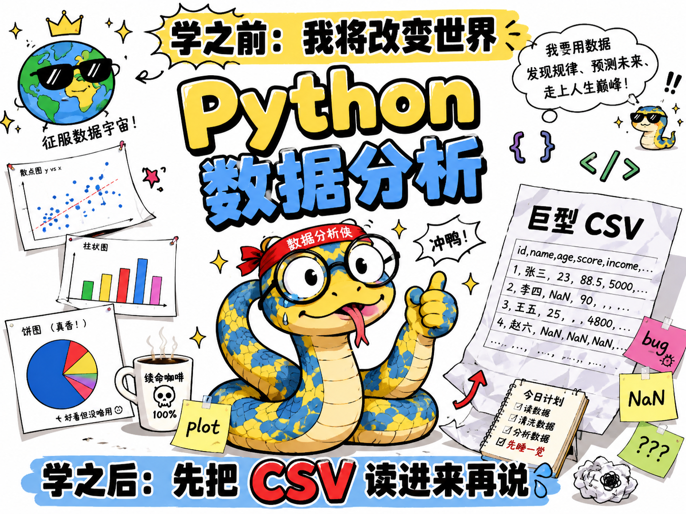

::: {.hero-section}

::: {.hero-text}
## Python 数据分析学习笔记

这里整理 Python 基础、NumPy、pandas、matplotlib、scikit-learn 以及数据分析项目、可视化案例和机器学习入门等相关内容。

> 用 Python 记录数据分析的学习过程。
:::

::: {.hero-image}

:::

:::

## 文章列表